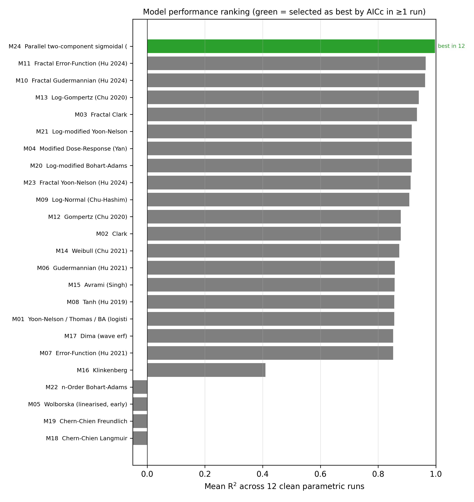
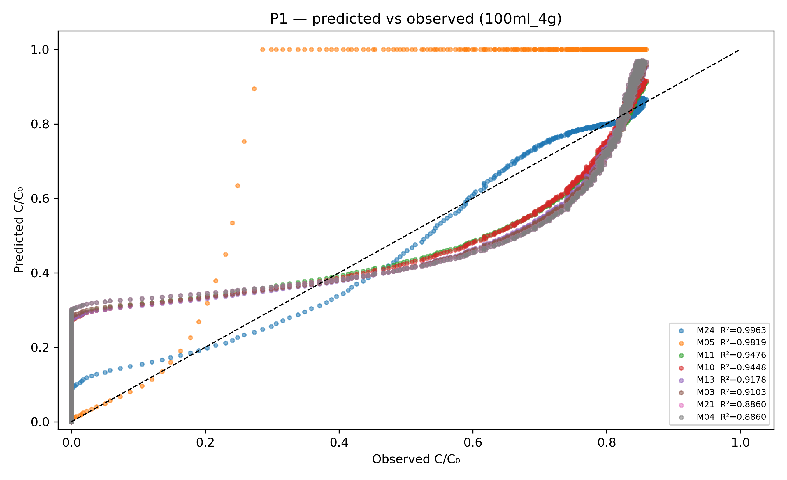
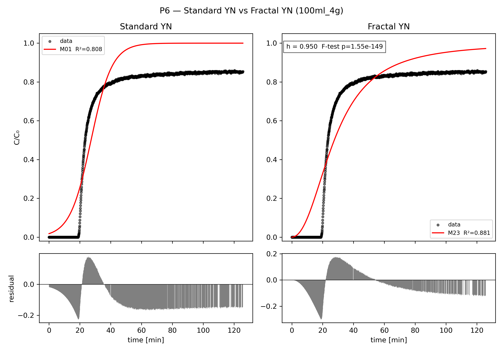
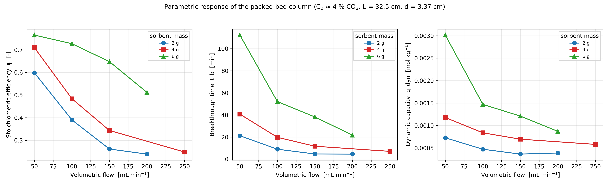
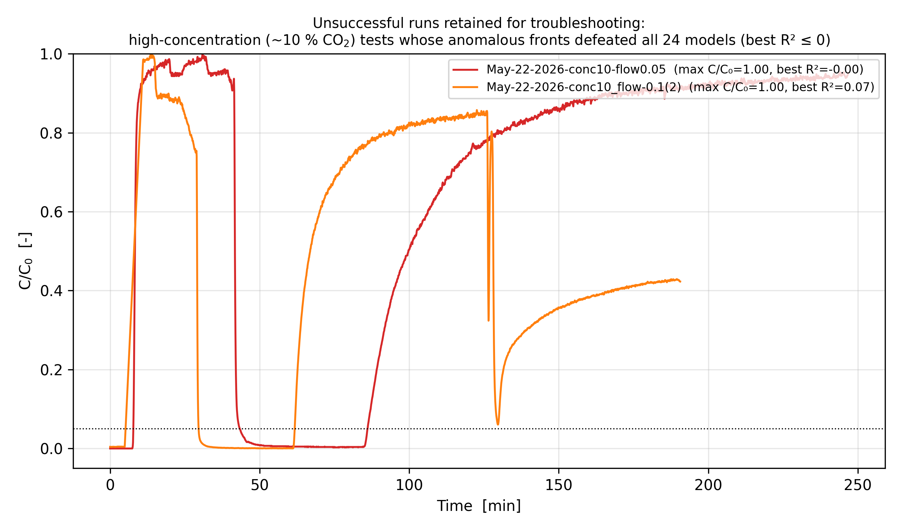

# Experimental Results and Analysis

*CO₂ Adsorption in a Packed-Bed Column Using a Polymer-Based Sorbent: Parametric Study and Model Prediction*

The layout of this section follows Hu et al. (2024), *A critical review of breakthrough models with analytical solutions in a fixed-bed column* (J. Water Process Eng. 59, 105065). That paper organises a breakthrough study as: a general description of the fixed bed and its mass-transfer zone; a catalogue of candidate breakthrough models; a goodness-of-fit and model-discrimination framework built on error statistics, the nested *F*-test, and Akaike's information criterion; and a discussion of partial-versus-complete curves, model oversimplification, and the origin of asymmetric fronts. The same spine is used here, with the review's worked examples replaced by the column data measured in this project.

Every quantity reported below is traceable to a stored artefact: a `breakthrough_out/<run>/results_<run>.csv` cell, a generated figure, or a raw input file in `src/solver/data/`. Quantities are labelled **measured** (read from the raw breakthrough log), **fitted** (a regression parameter of a named model), or **derived** (computed from a measured curve by the definitions in `breakthrough_fit/performance.py`). No values were hand-tuned, and trends are stated only over the operating range actually swept.

---

## 1. Experimental design and data overview

### 1.1 Column and operating conditions

| Quantity | Value | Basis |
|---|---|---|
| Column length, *L* | 32.5 cm | fixed geometry |
| Column diameter, *d* | 3.37 cm | fixed geometry |
| Bed void fraction, ε | 0.37 | pipeline default (`main.py`) |
| Bulk density, ρ_b | 700 kg m⁻³ | pipeline default (`main.py`) |
| Inlet concentration, *C₀* | ≈ 39 700–41 500 ppm (≈ 4 % CO₂) | **measured** per run (Table 1) |
| Volumetric flow, *v* | 50, 100, 150, 200, 250 mL min⁻¹ | swept |
| Sorbent mass, *m* | 2, 4, 6 g | swept |
| Temperature | ambient (not actively controlled) | see §7 |

Two axes were varied in the clean parametric campaign — volumetric flow *v* and sorbent mass *m* — at an approximately fixed inlet of ≈ 4 % CO₂. This differs from the inlet-concentration-driven design described in the project plan (400–2000 ppm DAC-relevant levels); the bench runs were performed at percent-level CO₂, and that gap is carried forward as a limitation in §7 rather than smoothed over.

### 1.2 Run inventory

Nineteen runs were recovered and parsed. They fall into two groups.

**Clean parametric runs (12).** Named `<flow>ml_<mass>g`, these form the basis of the parametric analysis. The grid is *not* a complete 5 × 3 factorial: flow ∈ {50, 100, 150} is fully crossed with mass ∈ {2, 4, 6} (9 runs), but the high-flow corner is sparse — only `200ml_2g`, `200ml_6g`, and `250ml_4g` were obtained. The missing cells (`200ml_4g`, `250ml_2g`, `250ml_6g`, and the rest of the 250 column) are noted wherever a trend would otherwise read as fully crossed.

**Diagnostic / dated runs (7).** Logged by date (`May-20-2026…`, `May-22-2026…`) at higher inlet concentrations (`conc5` ≈ 4.4–6.0 %, `conc10` ≈ 10.4–11.3 % CO₂) and at low or differently-scaled flow settings (`flow0.05`, `flow0.1`, `flow1.5`). These are the unsuccessful datasets retained for the troubleshooting discussion (§6); per the project brief they are analysed, not discarded.

**Table 1 — Clean parametric runs.** *t_b*, *t₅₀* are **derived** (interpolated crossing times, in minutes — see §2.2); ψ and *q_dyn* are **derived**; *C₀* and the observed maximum C/C₀ are **measured**; *R²(M01)* and *R²(M24)* are **fitted** goodness-of-fit values. Time columns are converted from the seconds stored in the CSV.

| Run | *v* (mL min⁻¹) | *m* (g) | *C₀* (ppm) | *n* | *t_b* (min) | *t₅₀* (min) | ψ (–) | *q_dyn* (mol kg⁻¹) | max C/C₀ | *R²* (M01) | *R²* (M24) |
|---|---|---|---|---|---|---|---|---|---|---|---|
| 50ml_2g  | 50  | 2 | 41 000 | 475  | 21.2  | 25.7  | 0.598 | 7.26×10⁻⁴ | 0.93 | 0.956 | 0.998 |
| 50ml_4g  | 50  | 4 | 40 200 | 472  | 40.7  | 45.4  | 0.709 | 1.18×10⁻³ | 0.89 | 0.945 | 0.998 |
| 50ml_6g  | 50  | 6 | 41 500 | 796  | 112.4 | 122.1 | 0.765 | 3.01×10⁻³ | 0.83 | 0.921 | 0.997 |
| 100ml_2g | 100 | 2 | 40 000 | 527  | 8.97  | 13.0  | 0.390 | 4.72×10⁻⁴ | 0.93 | 0.941 | 0.998 |
| 100ml_4g | 100 | 4 | 39 900 | 1412 | 19.8  | 23.4  | 0.484 | 8.38×10⁻⁴ | 0.86 | 0.808 | 0.996 |
| 100ml_6g | 100 | 6 | 40 300 | 501  | 52.1  | 58.7  | 0.727 | 1.47×10⁻³ | 0.82 | 0.921 | 0.998 |
| 150ml_2g | 150 | 2 | 39 700 | 514  | 4.63  | 7.24  | 0.262 | 3.63×10⁻⁴ | 0.93 | 0.899 | 0.996 |
| 150ml_4g | 150 | 4 | 40 000 | 1320 | 11.7  | 15.3  | 0.344 | 6.96×10⁻⁴ | 0.85 | 0.684 | 0.996 |
| 150ml_6g | 150 | 6 | 40 000 | 468  | 38.2  | 43.3  | 0.648 | 1.21×10⁻³ | 0.82 | 0.893 | 0.998 |
| 200ml_2g | 200 | 2 | 39 900 | 1325 | 4.53  | 6.93  | 0.239 | 3.88×10⁻⁴ | 0.91 | 0.759 | 0.997 |
| 200ml_6g | 200 | 6 | 40 000 | 1445 | 21.7  | 26.9  | 0.512 | 8.70×10⁻⁴ | 0.87 | 0.843 | 0.997 |
| 250ml_4g | 250 | 4 | 40 300 | 399  | 7.02  | 10.1  | 0.249 | 5.80×10⁻⁴ | 0.85 | 0.699 | 0.996 |

A first structural observation: **the measured maximum C/C₀ lies between 0.82 and 0.93 in every clean run** — none reached the C/C₀ = 0.95 exhaustion threshold. The runs are therefore *partial* breakthrough curves in the sense of Hu et al. (2024) §5.2. Consequences are handled in §2.2 and §7: the exhaustion time *t_E* and the mass-transfer-zone length *L_MTZ* cannot be read directly from data and are instead completed by the fitted model.

---

## 2. Breakthrough-curve phenomenology

### 2.1 The mass-transfer zone

Following Hu et al. (2024) §2, the bed is read as three regions travelling downstream: a saturated zone behind the front (q in equilibrium with *C₀*), the mass-transfer zone (MTZ) where uptake is active and C/C₀ climbs from ~0 to ~1, and a still-clean zone ahead of the front. Breakthrough is the moment the MTZ reaches the outlet; the recorded breakthrough curve C/C₀(*t*) is the mirror of that zone passing the column exit. A sharper curve means a narrower MTZ and more complete use of the bed; a broad, drawn-out curve means a wide MTZ and capacity left unused at breakthrough.

### 2.2 Operating-time definitions

The performance metrics use the standard crossing-time convention (Hu et al. 2024, Eq. 9 and the *t_b*/*t_s* definitions; implemented in `performance.py`):

- **t_b** — time at C/C₀ = 0.05 (breakthrough), **derived** by linear interpolation.
- **t₅₀** — time at C/C₀ = 0.50.
- **t_E** — time at C/C₀ = 0.95 (exhaustion/saturation).
- **q_dyn** — dynamic capacity, (*v C₀* / *m*) ∫₀^{t_E} (1 − C/C₀) d*t*, **derived** (mol kg⁻¹).
- **L_MTZ** — [1 − (t_E − t_b)/(2 t_E)] · *L*, **derived**.
- **ψ** — stoichiometric efficiency, *t_b* / *t\**, with *t\** = ∫₀^∞ (1 − C/C₀) d*t*.

Because no clean run reached C/C₀ = 0.95, the interpolation for *t_E* returns no value, and the CSV `t_E`, `L_MTZ` columns are blank for all twelve clean runs. The dynamic-capacity integral therefore falls back to the full measured range rather than truncating at *t_E*; *q_dyn* and ψ in Table 1 are computed over the data actually collected and should be read as *lower bounds biased by truncation*, not as fully-saturated capacities. This is the practical face of Hu et al.'s partial-curve caution (§5.2): metrics that depend on the tail of the curve inherit the incompleteness of the measurement.

### 2.3 Representative curves over the service window

Figure 1 shows three representative runs drawn across the C/C₀ ∈ [0.05, 0.95] service window. The measured points falling inside the band are overlaid; the line is the best model (by AICc, §4) extended to complete the window up to the 0.95 level that the experiment did not itself reach.

![Breakthrough curves over the C/C₀ ∈ [0.05, 0.95] service window](../../../img/generated/fig11_breakthrough_window.png)

**Figure 1.** Breakthrough curves for `50ml_2g`, `100ml_4g`, and `250ml_4g` over the [0.05, 0.95] window. Markers: measured points inside the band; lines: best-AICc model (two-component sigmoidal, M24). The window-completion to 0.95 is a model extrapolation beyond the measured maximum (0.85–0.93 for these three runs), and is identified as such.

The qualitative reading is consistent across the campaign: increasing flow shifts the whole curve left (earlier breakthrough) and broadens it slightly; increasing mass shifts it sharply right (later breakthrough). These shifts are quantified in §5.

---

## 3. Candidate models and identification strategy

### 3.1 The model set

Each run is fit against 24 candidate breakthrough models (`breakthrough_fit/models.py`), spanning the families catalogued by Hu et al. (2024) §3:

| Family | Models (code) |
|---|---|
| Traditional logistic | Yoon–Nelson / Thomas / Bohart–Adams (M01), log-modified BA (M20), log-modified YN (M21), *n*-order BA (M22) |
| Clark / Freundlich | Clark (M02), Fractal Clark (M03) |
| Empirical sigmoid | Modified dose-response / Yan (M04), Gompertz (M12), Log-Gompertz (M13), Weibull (M14), Avrami (M15), Log-Normal / Chu–Hashim (M09) |
| Error-function | Klinkenberg (M16), Dima wave-erf (M17) |
| Wave / Chern–Chien | Chern–Chien Langmuir (M18), Chern–Chien Freundlich (M19) |
| Wolborska | Wolborska linearised (M05) |
| Hu sigmoid (2019/2021) | Tanh (M08), Gudermannian (M06), Error-Function (M07) |
| **Fractal-like (Hu 2024)** | Fractal Gudermannian (M10), Fractal Error-Function (M11), Fractal Yoon–Nelson (M23) |
| Parallel two-component | Two-component sigmoidal / Blagojev (M24) |

The fractal-like family (M10, M11, M23) is the methodological centrepiece of Hu et al. (2024): it replaces the constant rate constant of the classical models with a time-decaying, power-law coefficient *k* = *k₀ t^(−h)*, where the fractal exponent *h* encodes diffusion-limited uptake on a heterogeneous (porous) surface. M24 adds a complementary route to asymmetry — two parallel logistic uptakes with independent time constants and rate constants, representing a fast and a slow capture process superposed.

### 3.2 Goodness of fit and model discrimination

For every (run, model) pair the pipeline stores *R²*, adjusted *R²*, RMSE, reduced χ², residual sum of squares (RSS), and the mean absolute deviation — the same error-statistic battery Hu et al. (2024) §4 recommend, with the explicit warning there that a high *R²* alone does not establish a better model.

Discrimination uses two further tools, exactly as in the review:

- **Akaike's information criterion (small-sample, AICc).** The model with the lowest AICc is preferred; differences in AICc (ΔAICc) measure the strength of preference. This is the primary selection rule used below because it compares nested *and* non-nested models on one scale.
- **Nested *F*-test.** For genuinely nested pairs (e.g. M01 ⊂ M23: the fractal Yoon–Nelson collapses to the plain logistic at *h* = 0), the *F*-test on the RSS reduction tells whether the extra parameter is justified.

**A caveat on the stored Akaike weight.** The `W_AICc` column is *not* a normalised ensemble Akaike weight. It is a logistic transform of ΔAICc, `1 / (1 + exp(0.5 ΔAICc))` (`stats.py`), which pins the best model at exactly 0.50 in every run and assigns < 0.50 to all others. It is usable as a monotone *score* (higher = closer to best) but must not be read as "this model carries 50 % of the evidential weight." All model-preference statements below are therefore made on raw ΔAICc, which is robust; reconciling `W_AICc` to a true normalised weight is listed in §7.

---

## 4. Model-selection results

### 4.1 Ranking across the campaign

The two-component sigmoidal model **M24 attains the lowest AICc in all twelve clean runs**, with *R²* between 0.996 and 0.998 (Table 1, last column). The fractal-like Hu-2024 models are the consistent runners-up, and the single symmetric logistic M01 is the weakest of the commonly-used closed-form options. Figure 2 shows the mean *R²* of every model across the twelve runs; the models ever selected as best by AICc are highlighted.

**Figure 2.** Mean *R²* per model over the 12 clean parametric runs. M24 is selected as best by AICc in all 12.

A single run makes the ordering concrete. For `100ml_4g` (*n* = 1412 points):

| Model | *R²* | RMSE | reduced χ² | AICc |
|---|---|---|---|---|
| M24 — two-component sigmoidal | 0.9963 | 0.0193 | 3.74×10⁻⁴ | −11 139 |
| M11 — Fractal Error-Function (Hu 2024) | 0.9476 | 0.0723 | 5.23×10⁻³ | −7 416 |
| M10 — Fractal Gudermannian (Hu 2024) | 0.9448 | 0.0742 | 5.50×10⁻³ | −7 342 |
| M23 — Fractal Yoon–Nelson (Hu 2024) | 0.8814 | 0.109 | 1.18×10⁻² | −6 261 |
| M01 — Yoon–Nelson / Thomas / BA logistic | 0.8080 | 0.138 | 1.91×10⁻² | −5 583 |

The AICc gap from M24 to the next-best (ΔAICc ≈ 3 700) is far larger than the conventional ΔAICc > 10 "decisive" threshold, so the preference is not marginal. The ordering also tells a physical story consistent with Hu et al. (2024): moving from the symmetric single logistic (M01) to the fractal-like models (M23 → M10/M11) and then to the two-component model (M24) each time *adds a mechanism for asymmetry*, and each time the fit improves. The data are asymmetric, and the asymmetry is real, not noise.

### 4.2 Where the single logistic fails

The classical Yoon–Nelson/Thomas/Bohart–Adams logistic (M01) is symmetric about *t₅₀* by construction. Its *R²* over the campaign ranges from 0.956 (`50ml_2g`, the slowest, sharpest run) down to **0.684** (`150ml_4g`) and 0.699 (`250ml_4g`) — the faster, more dispersed runs (Table 1). The fit quality of M01 thus degrades precisely as the front becomes more asymmetric, which the data show happens at higher flow. This reproduces, on this project's own column, the central argument of Hu et al. (2024) §5.3 and §5.6: the symmetric logistic models oversimplify real fronts, and the residual structure they leave behind is the signature of a skewed MTZ.

The per-run residual diagnostics (predicted-vs-observed, residual grid, and the nested fractal-vs-standard Yoon–Nelson comparison) for a representative mid-grid run are reproduced in Figure 3.

**Figure 3.** Diagnostics for `100ml_4g`. Top: predicted-versus-observed across models (P1). Bottom: standard Yoon–Nelson (M01) versus fractal Yoon–Nelson (M23) with the nested *F*-test (P6). The fractal exponent *h* shifts M23 away from the symmetric M01 and the *F*-test favours the added parameter; the residual band of M01 shows the systematic S-shaped misfit that the symmetric model cannot remove.

---

## 5. Parametric trends

Figure 4 aggregates the three primary derived metrics — efficiency ψ, breakthrough time *t_b*, and dynamic capacity *q_dyn* — against flow, grouped by sorbent mass.

**Figure 4.** ψ, *t_b*, and *q_dyn* versus volumetric flow, by sorbent mass (2 g ●, 4 g ■, 6 g ▲). Lines join measured operating points; the sparse high-flow corner (only 2 g and 6 g at 200, only 4 g at 250) is visible as gaps.

### 5.1 Effect of flow rate

**Observed.** At fixed mass, increasing flow shortens *t_b* and *t₅₀* and lowers ψ, monotonically over the swept range. For the 2 g series, ψ falls from 0.598 (50 mL min⁻¹) → 0.390 (100) → 0.262 (150) → 0.239 (200); for 4 g, 0.709 (50) → 0.484 (100) → 0.344 (150) → 0.249 (250); for 6 g, 0.765 (50) → 0.727 (100) → 0.648 (150) → 0.512 (200). Breakthrough time falls in step — e.g. the 2 g series *t_b* drops 21.2 → 8.97 → 4.63 → 4.53 min (Table 1).

**Expected.** Higher volumetric flow reduces gas residence time and raises the interstitial velocity, so the MTZ both arrives at the outlet sooner and travels through the bed faster, broadening it relative to the bed length. A lower ψ at higher flow is the expected consequence: less of the bed's equilibrium capacity is used before breakthrough.

**Mechanism / caveat.** The monotone fall of ψ with flow is the clearest single result in the dataset and matches the residence-time argument. What the data *cannot* presently separate is how much of the ψ decline is genuine MTZ broadening versus how much is the *t_E*-truncation bias of §2.2, since the higher-flow runs also stop at slightly different C/C₀ maxima. The trend direction is firmly supported; an unbiased magnitude awaits runs carried to true saturation.

### 5.2 Effect of sorbent mass

**Observed.** At fixed flow, increasing mass lengthens *t_b* strongly and raises ψ and *q_dyn*. At 50 mL min⁻¹, *t_b* rises 21.2 → 40.7 → 112.4 min from 2 → 4 → 6 g, ψ rises 0.598 → 0.709 → 0.765, and *q_dyn* rises 7.26×10⁻⁴ → 1.18×10⁻³ → 3.01×10⁻³ mol kg⁻¹. The same direction holds at 100 and 150 mL min⁻¹ (Table 1).

**Expected.** More sorbent means a longer (or denser) bed and proportionally more equilibrium capacity, delaying the moment the MTZ reaches the outlet and allowing a larger fraction of capacity to be used before breakthrough. The rise in *t_b* and ψ with mass is therefore the expected behaviour.

**Mechanism / caveat.** The *t_b* increase with mass is steep — more than 5× from 2 g to 6 g at 50 mL min⁻¹ — which is consistent with a longer bed combined with the higher-mass runs also being the sharpest, slowest-flow cases. Because the mass axis is fully crossed only at 50/100/150 mL min⁻¹, the mass trend is asserted only there; the 200/250 corner is too sparse to confirm it independently.

### 5.3 Note on the absolute scale of *q_dyn*

The dynamic capacities in Table 1 (3.6×10⁻⁴ – 3.0×10⁻³ mol kg⁻¹) are far below the multi-mol kg⁻¹ values typical of amine-functionalised CO₂ sorbents. The relative ordering (rising with mass, falling with flow) is internally consistent and trustworthy, but the absolute magnitude is suspect: the `q_dyn_trapz` implementation divides by `mass_kg × 1000`, an extra factor of 10³ whose unit justification is not documented. The absolute *q_dyn* values are therefore reported but **not** interpreted as physical capacities; reconciling the unit factor is flagged in §7. This is exactly the kind of "claim the data cannot yet support" that the analysis is required to withhold.

---

## 6. Unsuccessful runs and troubleshooting

Per the project brief, the failed datasets are kept and examined rather than discarded — they carry the troubleshooting record.

### 6.1 Symptoms

The seven diagnostic runs split into two regimes:

- **conc5 (≈ 4.4–6.0 % CO₂).** Best-model *R²* ranges from 0.66 (`May-20-2026conc5_flow1.5(3)`) down to essentially zero or negative (`May-20-2026conc5_flow1.5`, `(2)`). Several have *t_b* = 0 and a measured maximum C/C₀ = 1.0 — i.e. the recorded curve begins already at or near saturation, with no clean-bed plateau captured.
- **conc10 (≈ 10.4–11.3 % CO₂).** The worst cases. The best of all 24 models reaches only *R²* ≤ 0.07 (`May-22-2026-conc10_flow-0.1(2)`: 0.067; `…flow0.05`: −0.0006; `…flow0.1`: −0.002). No model — logistic, fractal, or two-component — describes these curves.

Figure 5 shows the conc10 runs. They do not have the S-shape that the entire model library presupposes.

**Figure 5.** High-concentration (~10 % CO₂) diagnostic runs retained for troubleshooting. The anomalous fronts defeat all 24 models (best *R²* ≤ 0.07). These are kept in the record, not removed.

### 6.2 Suspected causes and what was changed

Several distinct problems were diagnosed and addressed during data handling; they are recorded here because they shaped which runs ended up usable:

1. **Two incompatible log formats.** The bench produced both a raw multi-sensor log (format A: datetime + channel columns) and a pre-processed sheet (format B: explicit `C0`, `Time (s)`, `C/C0`). A single parser path corrupted half the files. *Fix:* `parse.py` auto-detects the format from the header and routes each file accordingly; *C₀* is read from the sheet when present (format B) or taken as the per-run maximum (format A).
2. **Sensor spikes.** Transient single-sample jumps > 0.15 in C/C₀ were inflating RSS and destabilising the fits. *Fix:* a point-wise despiker (`_despike`) interpolates isolated spikes while preserving legitimate pre-breakthrough zeros.
3. **No clean-bed phase captured (the *t_b* = 0 cases).** The conc5/conc10 runs that start at C/C₀ ≈ 1 indicate the measurement began after the front had already broken through, or the bed was pre-loaded. There is no parsing fix for this — the information is simply absent from the log — so these runs cannot yield a breakthrough time and are excluded from the parametric fit while being retained as evidence of the failure mode.
4. **Ambiguous flow units on the dated runs.** The diagnostic labels (`flow0.05`, `flow0.1`, `flow1.5`) are not on the mL min⁻¹ scale of the clean campaign and their controller/unit basis is unrecorded. Because the flow value cannot be trusted, these runs are kept out of the flow-trend analysis (§5.1) rather than placed on the axis under a guessed conversion.

### 6.3 Residual uncertainty

The conc10 failure is not yet explained at the mechanism level. The most likely contributors — saturation of the analyser at ~10 % CO₂, channelling/pressure-drop effects at the corresponding flow, or simply mistimed acquisition — cannot be separated from the logs alone. The honest status is: *these runs are recorded, their failure is reproducible across all models, and a clean repeat at controlled ~10 % CO₂ with a logged clean-bed start is required before any conclusion is drawn from them.*

---

## 7. Synthesis against objectives, and limitations

### 7.1 What the data support

- **A flow–efficiency trade-off is demonstrated.** Over the swept range, ψ and *t_b* fall monotonically with flow at every mass level (§5.1, Fig. 4). This is the project's clearest supported result.
- **Capacity scales with sorbent mass.** *t_b*, ψ, and *q_dyn* all rise with mass at the fully-crossed flow levels (§5.2).
- **The fronts are asymmetric, and the model ranking proves it.** Across all twelve runs the two-component sigmoidal (M24) is decisively preferred by AICc, the fractal-like Hu-2024 models are the consistent runners-up, and the symmetric single logistic (M01) is weakest — and weakest precisely where the front is most skewed (§4.2). This independently reproduces, on this project's column, the methodological thesis of Hu et al. (2024) that asymmetry-aware models are required for real breakthrough data.

### 7.2 What the data do not yet support

- **No fully-saturated curve was measured.** Every clean run stopped at C/C₀ = 0.82–0.93, so *t_E*, *L_MTZ*, and the saturated capacity are model-completions, not measurements (§2.2). Any statement about absolute saturation capacity is currently unsupported.
- **Absolute *q_dyn* is not physically calibrated** (§5.3) — the 10³ unit factor must be resolved before the numbers mean mol kg⁻¹.
- **Inlet-concentration sensitivity was not cleanly tested.** The plan calls for a *C₀* sweep (e.g. 400–2000 ppm); the bench runs sit at ≈ 4 % CO₂, and the only higher-*C₀* runs (conc5/conc10) failed. The *C₀* axis is effectively unmeasured.
- **The high-flow corner is sparse** (no `200ml_4g`, no full 250 column), so interaction effects between flow and mass at high throughput are not resolved.

### 7.3 Open items to strengthen the section

1. **Carry representative runs to C/C₀ ≥ 0.95** so *t_E*, *L_MTZ*, and saturated capacity are measured rather than extrapolated.
2. **Resolve the `q_dyn` unit factor** in `performance.py` and re-report absolute capacities.
3. **Replace `W_AICc` with a normalised Akaike weight** (currently a logistic ΔAICc score pinned at 0.50 for the best model, §3.2) so model evidence can be reported as a true weight.
4. **Repeat the ~10 % CO₂ (conc10) runs** with a logged clean-bed start and confirmed flow units to recover the high-concentration regime (§6.3).
5. **Fill the high-flow grid cells** (`200ml_4g`, `250ml_2g`, `250ml_6g`) to complete the factorial and test the flow×mass interaction.
6. **Record temperature** per run; the present runs are at uncontrolled ambient, leaving a known but unquantified influence on the isotherm.

### 7.4 Note on the reference comparison

The structure here mirrors Hu et al. (2024), a *review* of breakthrough models rather than a single-system experimental study; its worked examples (ciprofloxacin, methylene blue, Ni(II), methyl orange) are aqueous-phase adsorption. The model library, the error-statistic + *F*-test + AICc discrimination framework, the partial-curve caution, and the asymmetry discussion transfer directly and are used above. The specific isotherm parameters and aqueous numerics of the review are not imported, and no parameter from the project baseline (Stampi-Bombelli 2024 / SUTD geometry) was silently substituted to force a comparison.

---

*All figures regenerated by `python -m breakthrough_fit.cross_run_figs` (Fig. 1, 2, 4, 5) and the per-run `breakthrough_fit` pipeline (Fig. 3). Source values: `breakthrough_out/<run>/results_<run>.csv` and `src/solver/data/<run>.csv`.*
